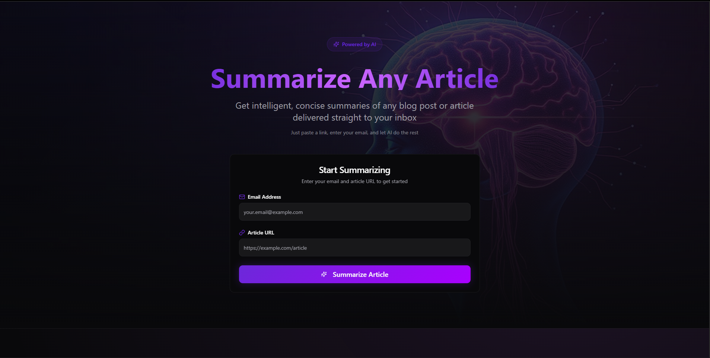

# 📄 Summarizer – AI-Powered Article Insights

This project is an **AI-driven article summarization and insights generator** built with:

* **Frontend:** [Lovable.dev](https://lovable.dev)
* **Backend:** [FastAPI](https://fastapi.tiangolo.com/)
* **Workflow Automation:** [n8n](https://n8n.io/)
* **Content Extraction:** [Firecrawl](https://www.firecrawl.dev/)

It allows users to submit an article URL and receive:

* A **concise summary** of the content.
* **3–5 key AI-related insights** (focused on tools, technologies, and practical applications).
* Results delivered via **email** and stored in **Google Sheets** for tracking.

---

## 🎥 Demo  

[](https://drive.google.com/file/d/1otsmFZX_K545uIyd9jVJq-NTVflkV-aV/view?usp=sharing)


## ⚡ Features

* 🌐 Extracts article content (headings + body) using **Firecrawl**.
* 🤖 Summarizes long texts with **Google Gemini (PaLM) LLM**.
* 🔍 Extracts **AI-focused insights** with custom prompt engineering.
* 📬 Sends results directly to the user’s email.
* 📊 Stores session data (URL, summary, insights, email) in **Google Sheets**.
* ⏱ Automated orchestration & retries using **n8n workflow automation**.

---

## 🛠️ Tech Stack

* **Frontend:** Lovable.dev (no-code frontend for user submissions).
* **Backend:** FastAPI (handles API requests & integrates with n8n webhook).
* **Workflow Engine:** n8n (orchestrates Firecrawl → LLM → Insights → Email → Sheets).
* **Extractor:** Firecrawl (structured extraction of article content).
* **LLM Models:** Google Gemini (PaLM API) for summarization & insights.
* **Storage:** Google Sheets (append/update results per session).
* **Mailer:** Gmail API (sends results to users).

---

## 🔄 Workflow Overview

1. **User submits** an article URL + email via the Lovable.dev frontend.
2. **FastAPI backend** forwards the request to the **n8n webhook**.
3. **Firecrawl** extracts the raw headings + body text.
4. n8n checks if extraction is completed → polls results.
5. **Text processing**:

   * Summarizer node → generates 3–5 sentence summary.
   * Insight generator node → extracts AI-related key insights.
6. **Merge results** → send via **email** to user.
7. **Google Sheets** → session data stored for tracking & analytics.

---

## 📂 Project Structure

```bash
.
├── frontend/         # Built with Lovable.dev
├── backend/          # FastAPI server handling API + webhook requests
├── workflows/        # n8n JSON workflows
│   └── summarizer.json
├── docs/             # Documentation & diagrams
└── README.md
```

---

## 🚀 Getting Started

### 1️⃣ Clone the repository

```bash
git clone https://github.com/FahimS45/AI_agents.git
cd n8n_AI_automation/Summarizer_and_insight_generator_with_firecrawl
```

### 2️⃣ Setup Backend (FastAPI)

```bash
cd backend
pip install -r requirements.txt
uvicorn main:app --reload
```

### 3️⃣ Setup n8n Workflow

* Import `workflows/Summarizer_.json` into your n8n instance.
* Add credentials for:

  * Firecrawl API
  * Google Gemini (PaLM) API
  * Gmail OAuth2
  * Google Sheets API

### 4️⃣ Frontend (Lovable.dev)

* Configure the submission form to send data (`article_url`, `email`, `session_id`) to the **FastAPI backend**, which triggers the n8n webhook.

---

## 📧 Example Output

**Email sent to user:**

```
Hello,

Here is the summary of the article you submitted:

"AI is transforming leadership by enhancing strategy, business intelligence, and customer understanding."

And the key insights:
- AI enables predictive analytics for sales and demand forecasting.
- Automates BI with pattern detection and virtual assistants.
- Enhances customer sentiment analysis and personalization.

Thank you for using our service.

If you’d like to analyze more articles, feel free to submit them anytime.

Best regards,
Your Article Insights Team
```

---

## ✅ To-Do / Improvements

* [ ] Add user authentication for API requests.
* [ ] Enable multi-language support.
* [ ] Dashboard in frontend for past summaries & insights.
* [ ] Deploy FastAPI backend to cloud (e.g., Render/Heroku/AWS).

---

## 📜 License

MIT License © 2025 Fahim Shahriar

---


